<<<<<<< codex/deploy-enhanced-github-profile-with-svgs-4myhtn
<h1 align="center">⚡ Vibe Coder | Building the Future One Commit at a Time ⚡</h1>

<!-- Enhanced typing effect -->
<p align="center">
  <a href="https://github.com/saaedimam">
    
  </a>
</p>

<p align="center">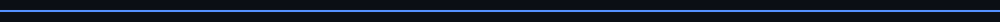</p>

## 🎭 About Me

```ascii
▒█▀▀█ ░█▀▀█ ▀▀█▀▀ ▀▀█▀▀ ▀▀█▀▀ ▒█▀▄▀█ 
▒█▀▀▄ ▒█▄▄█ ░▒█░░ ░▒█░░ ░▒█░░ ▒█▒█▒█ 
▒█▄▄█ ▒█░▒█ ░▒█░░ ░▒█░░ ░▒█░░ ▒█░░▒█ 
```

- 🔮 I **code in vibes** and ship with flow  
- 🧵 **StitchOS** → IoT SaaS for real-time textile RFID  
- 🚗 **PickMyDrive** → first-party used-car platform  
- 💸 **QuickBill & CartCount** → pocket finance + inventory  
- 🌃 Neon nights, lo-fi beats, futuristic dreams

## 🖥️ Live Terminal
<p align="center">
  
</p>

<p align="center"></p>

## ⚙️ Tech Arsenal
<p align="center">
  
</p>

### 🎯 Skill Mastery
<p align="center">
  
</p>

<p align="center"></p>

## 📊 Vibe Analytics & Live Status

<p align="center">
  
</p>

<p align="center">
  
  
</p>

<p align="center">
  
</p>

## ⚡ Live GitHub Activity
<p align="center">
  
</p>

<p align="center">
  
  
</p>

<p align="center"></p>

## 🏆 Achievements
<p align="center">
  
</p>

<p align="center"></p>

## 🚀 Featured Projects

<div align="center">

### 🧵 StitchOS - IoT Textile Revolution
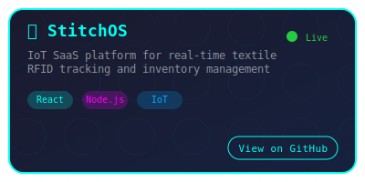

**Revolutionary IoT SaaS platform for real-time textile RFID tracking**

**Tech Stack:** React • Node.js • IoT Core • RFID • Real-time Analytics • PostgreSQL • Docker • AWS  
**Status:** 🟢 Live & Scaling  
**[View Project](https://github.com/saaedimam/StitchOS)** | **[Live Demo](https://stitchos.com)**

---

### 🚗 PickMyDrive - Smart Car Marketplace  


**Next-generation first-party used car platform with AI-powered valuations**

**Tech Stack:** Next.js • TypeScript • Supabase • Stripe • AI/ML • Prisma • Tailwind CSS • Vercel  
**Status:** 🟡 Beta Testing  
**[View Project](https://github.com/saaedimam/PickMyDrive)** | **[Beta Access](https://pickmydrive.com)**

---

### 💸 QuickBill & CartCount - FinTech Suite


**Comprehensive financial management and inventory tracking suite**

**Tech Stack:** Flutter • Firebase • Python • FastAPI • AI/ML • OCR • Cloud Functions • Analytics  
**Status:** 🟢 Production Ready  
**[View Project](https://github.com/saaedimam/QuickBill)** | **[Download App](https://play.google.com/store)**

</div>

<p align="center"></p>

## 🐍 Contribution Snake & 3D
<p align="center">
  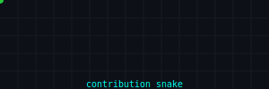
</p>
<p align="center">
  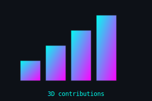
</p>

<p align="center"></p>
## 🧩 Icon Gallery (20 Cool Stuffs)
<p align="center">
  
  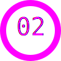
  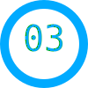
  
  
  
  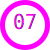
  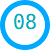
  
  
  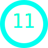
  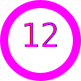
  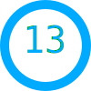
  
  
  
  
  
  
  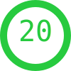
</p>


## 🌌 Connect With The Vibe

<p align="center">
  
</p>

<div align="center">

### 🔗 Professional Links
<a href="https://www.linkedin.com/in/saaedimam"></a>
<a href="mailto:sayedimam.fahim@gmail.com"></a>
<a href="https://www.upwork.com/freelancers/~012257680710d680c7"></a>

### 🎭 Social Vibes  
<a href="https://twitter.com/ioriimasu"></a>
<a href="https://github.com/saaedimam"></a>

### 💼 Open for:
- 🚀 **Innovative IoT Projects**
- 🌐 **Full-Stack Development**  
- 🎯 **Technical Consultancy**
- 🤝 **Open Source Collaboration**

</div>

<p align="center"></p>

<!-- ====== ENHANCED CYBERPUNK FOOTER ====== -->
<p align="center">
  
</p>

<div align="center">

### ⚡ The Vibe Philosophy
*"Code is poetry, bugs are plot twists, and every commit is a step toward digital immortality."*

**~ IORI IMASU • VIBE CODER • FUTURE BUILDER ~**


**Made with 💜 in Bangladesh 🇧🇩 | Powered by ☕ & 🎵**

</div>
=======
>>>>>>> main
