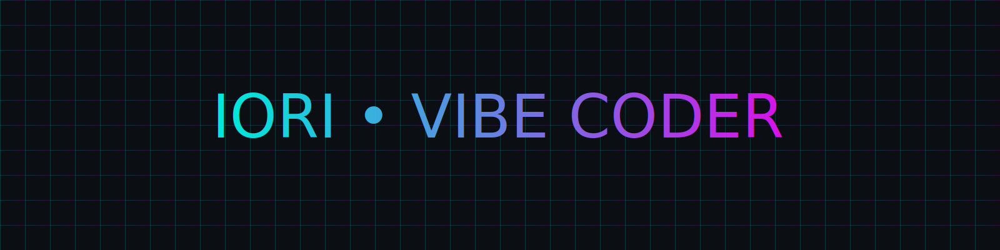

<!-- ====== CYBERPUNK NEON BANNER (ANIMATED SVG, ULTRA-LIGHT) ====== -->
<p align="center">
  
</p>

<h1 align="center">⚡ Vibe Coder | Building the Future One Commit at a Time ⚡</h1>

<!-- Typing effect -->
<p align="center">
  <a href="https://github.com/saaedimam">
    
  </a>
</p>

<p align="center"></p>

## 🎭 About Me

```ascii
▒█▀▀█ ░█▀▀█ ▀▀█▀▀ ▀▀█▀▀ ▀▀█▀▀ ▒█▀▄▀█ 
▒█▀▀▄ ▒█▄▄█ ░▒█░░ ░▒█░░ ░▒█░░ ▒█▒█▒█ 
▒█▄▄█ ▒█░▒█ ░▒█░░ ░▒█░░ ░▒█░░ ▒█░░▒█ 
```

- 🔮 I **code in vibes** and ship with flow  
- 🧵 **StitchOS** → IoT SaaS for real-time textile RFID  
- 🚗 **PickMyDrive** → first-party used-car platform  
- 💸 **QuickBill & CartCount** → pocket finance + inventory  
- 🌃 Neon nights, lo-fi beats, futuristic dreams

<p align="center"></p>

## ⚙️ Tech Arsenal
<p align="center">
  
</p>

<p align="center"></p>

## 🎛 Vibe Zone
- ⚡ **Code fast** — iterate, test, repeat  
- ⚡ **Break limits** — if it glitches, it’s art  
- ⚡ **Stay curious** — dive down rabbit holes

```ascii
▄▀▄ █▄░█ ▄▀▄ ▄▀ █░░ █░░ ▄▀▄ █▀▄
█▀█ █░▀█ █▀█ █▀ █▄▄ █▄▄ █▀█ █▄▀
```

<p align="center"></p>

## 📊 Stats & Activity
<p align="center">
  
  
</p>

<p align="center">
  
</p>

<p align="center">
  
  
</p>

<p align="center"></p>

## 🏆 Achievements
<p align="center">
  
</p>

<p align="center"></p>

## 🐍 Contribution Snake + 3D
<p align="center">
  
</p>
<p align="center">
  
</p>

<p align="center"></p>

## 🚀 Featured Projects
- 🧵 **[StitchOS](https://github.com/saaedimam/StitchOS)** — weaving digital textiles in real time  
- 🚗 **[PickMyDrive](https://github.com/saaedimam/PickMyDrive)** — next-gen used car platform  
- 💸 **[QuickBill](https://github.com/saaedimam/QuickBill)** — pocket accountant for everyone  

<p align="center"></p>

## 🌌 Connect With Me
<p align="center">
  <a href="https://www.linkedin.com/in/saaedimam"></a>
  <a href="https://twitter.com/ioriimasu"></a>
  <a href="mailto:sayedimam.fahim@gmail.com"></a>
  <a href="https://www.upwork.com/freelancers/~012257680710d680c7"></a>
</p>

<!-- ====== CYBERPUNK FOOTER (ANIMATED) ====== -->
<p align="center">
  
</p>
<p align="center"><i>“Glitch is the system showing its soul.” — IORI</i></p>
